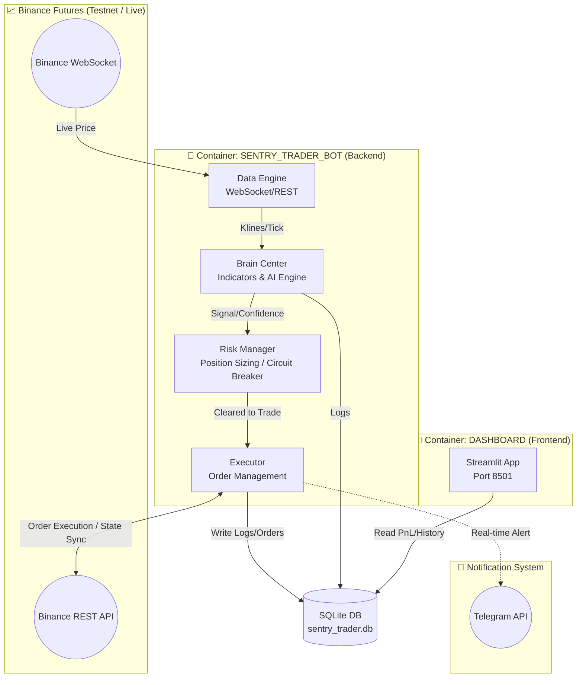
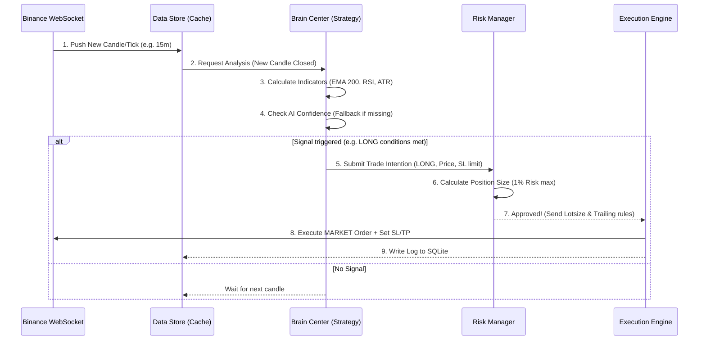

# 🚀 SENTRY_TRADER V1.0
**The Ultimate AI Cryptocurrency Trading Bot**


> **"Survive First, Profit Later"** <br>
> ยินดีต้อนรับสู่ **SENTRY_TRADER** สุดยอด AI Cryptocurrency Trading Bot ที่ถูกออกแบบมาเพื่อความแม่นยำ ปลอดภัย และการควบคุมความเสี่ยงอย่างเข้มงวด ระบบนี้ทำงานบนโครงสร้างแบบ Micro-module Architecture พร้อมรองรับการรันผ่าน Docker เต็มรูปแบบ

---

## ✨ จุดเด่นของระบบ (Key Features)

* 🧠 **Hybrid Brain Center:** ผสานการทำงานระหว่าง Technical Indicators พื้นฐาน และโมเดล Machine Learning (AI)
* 🛡️ **Ironclad Risk Management:** ระบบจำกัดความเสี่ยงต่อไม้ (Fixed Fractional) และ Circuit Breaker ตัดขาดทุนรายวัน
* 🐳 **Dockerized Architecture:** แยกระบบ Bot และ Dashboard ออกจากกันเพื่อประสิทธิภาพสูงสุด
* 📊 **Real-time Dashboard:** ติดตาม PnL และประวัติการเทรดผ่าน Streamlit Web App
* 📱 **Telegram Integration:** แจ้งเตือนทุกความเคลื่อนไหว (Buy/Sell/SL/TP) ตรงสู่มือถือของคุณ

---

## 🏗️ สถาปัตยกรรมระบบ (System Architecture)

ระบบถูกออกแบบให้ทำงานแบบแยกส่วน (Modular) ภายใน Docker Containers เพื่อความเสถียรและง่ายต่อการ Deploy



---

## 🚦 ลำดับการทำงาน (Trading Logic Flow)

เมื่อเปิดใช้งาน ระบบจะทำงานเป็นลูปแบบ Real-time ตามลำดับเหตุการณ์ดังนี้:



---

## 🔒 กลไกป้องกันความเสี่ยง (The Defensive Layers)

SENTRY_TRADER ให้ความสำคัญกับการรักษาเงินทุนเป็นอันดับหนึ่ง:

1.  📉 **Fixed Fractional Sizing:** จำกัดความเสี่ยงสูงสุด `1%` ของพอร์ตต่อออเดอร์ (คำนวณ Lot Size อัตโนมัติจากระยะ ATR)
2.  🧩 **Margin Constraint:** บังคับใช้ Margin Type แบบ `ISOLATED` เสมอ เพื่อป้องกันการลากจนล้างพอร์ตโหมด Cross
3.  🛡️ **Dynamic Trailing Stop Loss:** กฎเหล็ก "ห้ามปล่อยให้กำไรกลายเป็นขาดทุน" ระบบจะดึง SL ขยับตามราคาเมื่อกำไรถึง 1R
4.  🛑 **Circuit Breaker:** หากขาดทุนสะสมในวันนั้นเกิน `5%` ระบบจะหยุดเทรดทันที เพื่อป้องกันการ Overtrade เอาคืนด้วยอารมณ์

---

## 📂 โครงสร้างโปรเจกต์ (Directory Structure)

```text
c:\Crypto\SENTRY_TRADER\
├── .env                  # 🔐 ตั้งค่า API Keys, โหมดการรัน, Telegram
├── config.py             # ⚙️ ตั้งค่าความเสี่ยง, Timeframe (Single Source of Truth)
├── main.py               # 🚀 จุดศูนย์กลางรันระบบและเริ่ม Thread
├── docker-compose.yml    # 🐳 โครงสร้างรัน Docker (Bot + Dashboard)
├── Dockerfile            # สคริปต์สร้าง Image สำหรับ Bot
├── Dockerfile.dashboard  # สคริปต์สร้าง Image สำหรับ Dashboard
│
├── brain_center/         # 🧠 หัวใจการประมวลผล (Indicators & AI)
│   ├── ai_model.py
│   ├── indicators.py
│   ├── signal_engine.py
│   ├── train.py          # สคริปต์ Train โมเดล ML
│   ├── backtester.py
│   └── models/           # ที่เก็บไฟล์ .joblib ของระบบ AI
│
├── data_engine/          # 📡 จัดการการเชื่อมต่อและดึงข้อมูล Binance
├── risk_manager/         # 🛡️ คำนวณ Lot, Circuit breaker, SL/TP
├── executor/             # ⚔️ ส่งคำสั่งซื้อขายและติดตาม Position
├── monitoring/           # 📢 ระบบแจ้งเตือน Telegram
├── dashboard/            # 📊 หน้าเว็บ Streamlit ดูสถิติ PnL
└── database/             # 🗄️ โฟลเดอร์เก็บฐานข้อมูล SQLite
```

---

## ⚙️ การตั้งค่าและใช้งาน (Deployment)

ควบคุม Environment ทั้งหมดได้ง่ายๆ ผ่านไฟล์ `.env` เพียงไฟล์เดียว:

```ini
# --- Trading Mode ---
TRADING_MODE=testnet  # ใช้ 'testnet' สำหรับจำลอง / 'live' สำหรับเงินจริง

# --- Binance API ---
BINANCE_API_KEY=your_api_key_here
BINANCE_API_SECRET=your_api_secret_here

# --- Telegram Alerts ---
TELEGRAM_BOT_TOKEN=your_telegram_bot_token
TELEGRAM_CHAT_ID=your_chat_id
```

### การเปิดระบบ AI (Machine Learning Mode)
ระบบรองรับการใช้ Machine Learning หากคุณรันสคริปต์ `brain_center/train.py` ด้วย Data ย้อนหลัง ระบบจะสร้างไฟล์ `random_forest.joblib` ไปวางในโฟลเดอร์ `models/` เมื่อมีไฟล์นี้อยู่ บอทจะสลับตัวเองไปใช้ AI ในการยืนยันความแม่นยำ (Confidence > 85%) ทันทีในรอบการประมวลผลถัดไป!

---

## ⚠️ คำเตือน (Disclaimer)
การเทรด Cryptocurrency Future มีความเสี่ยงสูงมาก โปรแกรมนี้เป็นเพียงเครื่องมืออัตโนมัติตามอัลกอริทึมที่ตั้งไว้ ผู้พัฒนาจะไม่รับผิดชอบต่อความสูญเสียทางการเงินใดๆ กรุณาทดสอบในโหมด `Testnet` ให้เข้าใจพฤติกรรมของระบบอย่างถ่องแท้ก่อนนำไปใช้กับเงินจริงเสมอ
```