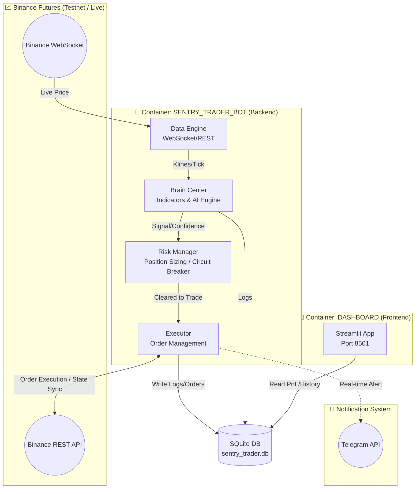
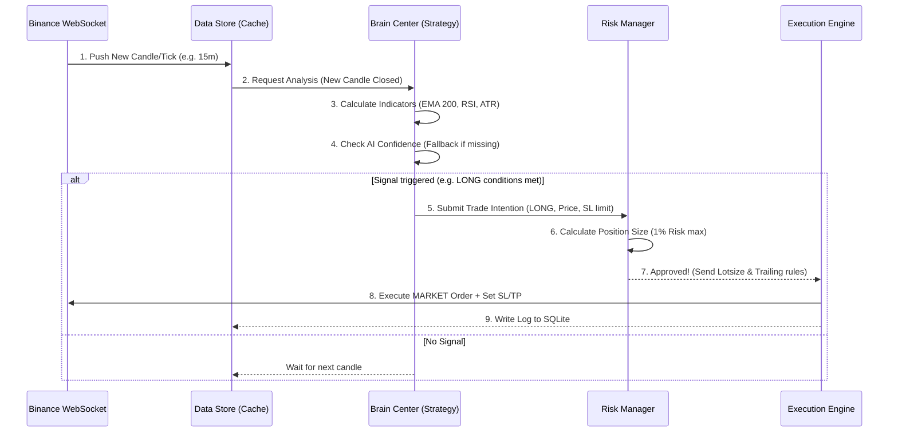

# 🚀 SENTRY_TRADER V1.0 - The Ultimate Guide & System Walkthrough

ยินดีต้อนรับสู่ **SENTRY_TRADER** สุดยอด AI Cryptocurrency Trading Bot ที่ถูกออกแบบมาเพื่อความแม่นยำ ปลอดภัย และการควบคุมความเสี่ยงอย่างเข้มงวด เอกสารฉบับนี้คือพิมพ์เขียว (Blueprint) ที่เจาะลึกการทำงานทุกซอกทุกมุมของระบบ ทั้งสถาปัตยกรรม (Architecture) โครงสร้างไฟล์ ไปจนถึง Flow การส่งคำสั่งซื้อขายจริง

---

## 🏗️ 1. สถาปัตยกรรมระบบ (System Architecture & Diagrams)

SENTRY_TRADER ใช้งานแบบ **Micro-module Architecture** โดยแบ่งแยกหน้าที่การทำงานอย่างชัดเจนเพื่อลดความซ้ำซ้อน และเพื่อให้ง่ายต่อการบำรุงรักษา ทั้งหมดนี้ถูกแพ็คไว้ใน Docker Contaners เพื่อให้ทำงานได้ทั้งบน Server, VPS หรือแม้แต่เครื่องส่วนตัว



> [!NOTE]
> ระบบหลังบ้านและการตัดสินใจทั้งหมดถูกจัดการโดย `sentry_trader_bot` ในขณะที่ `sentry_dashboard` มีหน้าที่เพียงอ่านข้อมูลจากฐานข้อมูล (`SQLite`) เพื่อแสดงผลเป็นกราฟ ลดภาระของระบบเทรดหลัก

---

## 📂 2. โครงสร้างไฟล์ (Directory Structure)

ระบบแตกโมดูลแยกฟังก์ชันกันอย่างชัดเจน:
```text
c:\Crypto\SENTRY_TRADER\
├── .env                  # ซ่อน API Keys, Mode (Testnet/Live), Telegram Credentials
├── config.py             # Single Source of Truth เก็บ Config ตัวเลข, Timeframes, ความเสี่ยง
├── main.py               # จุดศูนย์กลาง (Core Runtime) ที่ผูกทุกระบบเข้าด้วยกัน และเริ่ม Thread WebSocket
├── docker-compose.yml    # โครงสร้างสำหรับ Docker (แบ่ง 2 Service: bot และ dashboard)
├── Dockerfile            # สคริปต์สร้าง Image ของฝั่ง Bot
├── Dockerfile.dashboard  # สคริปต์สร้าง Image ของฝั่ง Dashboard
│
├── brain_center/         # 🧠 หัวใจของการประมวลผลอินดิเคเตอร์และ AI
│   ├── ai_model.py       # จัดการโมเดล Machine Learning (ดึงไฟล์ Random Forest มา Infer)
│   ├── indicators.py     # ตัวคำนวณ TA (EMA, RSI, ATR, MACD ทั่วไป) 
│   ├── signal_engine.py  # รวม Indicator และ AI เพื่อตัดสินใจหาจุด Long/Short
│   ├── train.py          # สคริปต์สำหรับ Train โมเดล AI จาก Data ย้อนหลัง
│   ├── backtester.py     # โมดูลระบบทดสอบ Backtest กลยุทธ์
│   └── models/           # (โฟลเดอร์) สำหรับวางไฟล์ .joblib ของระบบ AI
│
├── data_engine/          # 📡 ท่อน้ำเลี้ยงข้อมูล
│   ├── binance_client.py # ตัวแปรจัดการเรียก API GET/POST ไปยัง Binance (REST & WS)
│   └── data_store.py     # Cache Buffer เก็บแท่งเทียน Candlesticks และอัปเดตแบบ Realtime
│
├── risk_manager/         # 🛡️ โล่ป้องกันพอร์ต
│   ├── position_sizer.py # ตัวคำนวณ Lot Size อัตโนมัติ ป้องกันกิน Margin เกิน
│   ├── risk_guard.py     # Circuit breaker ตัดขาดทุนรายวันจำกัด Drawdown
│   └── stop_loss.py      # คำนวณขอบเขต SL และการขยับ Trailing Stop Loss
│
├── executor/             # ⚔️ แขนขาสำหรับส่งออเดอร์
│   ├── order_executor.py # ผู้รับสัญญาณที่ผ่านด่าน Risk แล้ว คุยกับ Binance เพื่อส่งคำสั่ง MARKET/LIMIT
│   └── portfolio_tracker.py # ตัวจำลองและ Sync สถานะว่าเราติดดอยหรือมี Position อะไรค้างในกระดาน
│
├── monitoring/           # 📢 ระบบแจ้งเตือน
│   └── telegram_bot.py   # ส่งข้อความเข้ามือถือเมื่อเกิดอีเวนต์เทรด (Buy/Sell/SL/TP)
│
├── dashboard/            # 📊 หน้าต่างสถานะ
│   └── app.py            # Streamlit Dashboard อ่านไฟล์ .db มา Plot กราฟ
│
└── database/             # 🗄️ ความจำถาวร
    └── sentry_trader.db  # ฐานข้อมูล SQLite (Mount ออกไปนอก Docker เลี่ยงข้อมูลหาย)
```

---

## 🚥 3. ลำดับเหตุการณ์ (Lifecycle Logic Flowchart)

ลำดับขั้นตอนการตัดสินใจว่า **Bot จะซื้อ-ขายตอนไหน?**



### คำอธิบาย Flow การทำงานหลัก (Run Loop):
1. **Connect & Sync:** เมื่อรัน `main.py` ระบบจะเช็ค State ก่อน ว่าตอนนี้ในพอร์ต Binance ทิ้งออเดอร์อะไรค้างไว้ไหม (Reconciliation process) เพื่อโหลดคืนเข้าสู่ระบบ `portfolio_tracker` 
2. **Data Streaming:** `binance_client.py` จะเปิด WebSocket คอยดูดแท่งเทียน 15 นาที และ 4 ชั่วโมง จากนั้นจับเทรวมที่ `data_store.py` เป็น Array 500 แท่ง
3. **Signal Evaluation:** พอปิดแท่งปุ๊บ `signal_engine.py` จะเรียก `indicators.py` หาเทรนด์ด้วย EMA และหาจุดตัด RSI
   - ถ้า *มีโมเดล AI* (`random_forest.joblib`) → หยอด Indicator เข้าไปทำนายความน่าจะเป็น (Confidence > 85%)
   - ถ้า *ไม่มีโมเดล AI* → Fallback ใช้กลไก Rule-based indicator ธรรมดา 
4. **Risk & Safety Filtering:** สัญญาณจะถูกส่งไปที่ `risk_guard.py` เพื่อเช็คว่าวันนี้ขาดทุน (Daily Drawdown) เกิน 5% หรือยัง? ถ้ายัง จะส่งไปหาขนาดไม้ตีที่ `position_sizer.py` เพื่อบังคับลงเงินไม่เกิน 1% ของพอร์ต
5. **Execution & Alert:** สุดท้าย `order_executor.py` จะรับหน้าที่ฟาดออเดอร์ผ่าน REST API ไปที่ Binance พร้อมตั้ง Trailing Stop จากนั้นส่ง Signal เข้า `monitoring/telegram_bot.py` เพื่อยิงข้อความเด้งเข้ามือถือ

---

## 🔒 4. เครื่องมือการบริหารความเสี่ยง (The Defensive Layers)

SENTRY_TRADER ไม่ใช่บอทสายซิ่ง แต่เป็นบอทสายเอาตัวรอด (Survive First, Profit Later):

1. **Fixed Fractional Sizing (`RISK_PER_TRADE = 0.01`):** ระบบจะคำนวณระยะ SL (ตามความกว้างของ ATR) และบีบหลอด (Lot Size) ไม่ให้เสียเงินเกิน 1% เมื่อโดน SL เด็ดขาด แม้ตลาดจะสวิงหนักก็ตาม
2. **Margin Constraint:** ล็อก Margin Type เป็น `ISOLATED` เสมอใน Binance ป้องกันการลากจนล้างพอร์ตโหมด Cross
3. **Dynamic Trailing Stop Loss:** กฎเหล็ก "ห้ามปล่อยให้กำไรกลายเป็นขาดทุน" หากวิ่งไปถึง 1R (1 เท่าของความเสี่ยง) `stop_loss.py` จะปรับดึง SL ขยับตามราคาสูงสุดแบบอัตโนมัติ 
4. **Circuit Breaker (`DAILY_LOSS_LIMIT`):** ถ้าเจอตลาดพัง และทำให้บอทโดนตัดขาดทุนรวมกันเกิน % ต่อวัน (ตั้งไว้ที่ 5%) บอทจะหยุด Trade ทันทีในวันนั้นและรอวันใหม่เพื่อ Reset ตัวเอง ป้องกันการ Overtrade เพื่อเอาคืน

---

## 🔥 5. โหมดการ Deploy (Configurations)

SENTRY_TRADER จัดการ Environment ผ่านไฟล์ `.env` เพียงไฟล์เดียว :
* **Testnet (`TRADING_MODE=testnet`)**: รันจำลองด้วยเงิน 100 USDT (สามารถทดลองความแรงของอัลกอริทึมได้ทุกเมื่อ)
* **Live (`TRADING_MODE=live`)**: ต่อชนกับ API Keys บัญชีเงินจริง (เตือน: ระบบจะประยุกต์ใช้ Risk manager ของสถิติเงินจริงทั้งหมดอย่างเข้มข้น)
* **Telegram Integration**: ผูก Token ระบบเพื่อเป็น Push Notification ตรงสู่มือถือคุณตลอด 24ชม.

> [!IMPORTANT]
> **AI Mode (Machine Learning)**
> ปัจจุบัน SENTRY ทำงานบน Infrastructure ที่พร้อมเทรนระบบ AI หากคุณนำ History 2 ปีโยนผ่าน `train.py` คุณจะได้ไฟล์ `random_forest.joblib` ไปวางไว้ในโฟลเดอร์ `brain_center/models/` และระบบจะสลับตัวเองสู่การตัดสินใจด้วยปัญญาประดิษฐ์ในรอบบิล (Tick) ถัดไปโดยทันที!
